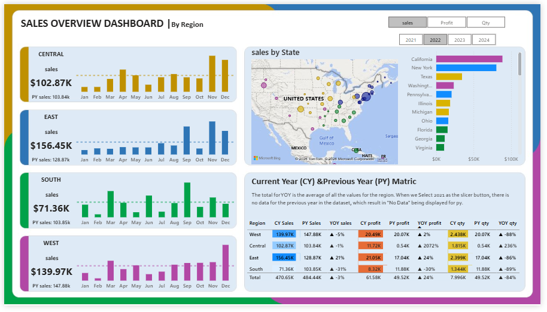

# 📊 Sales Overview Dashboard — Power BI

## 📌 Project Overview
A fully dynamic Power BI dashboard that tracks **Sales, Profit & Quantity**
across 4 regions — Central, East, South & West — with complete
Year-over-Year performance comparison.

## 🛠️ Tools & Technologies
- Power BI Desktop
- Microsoft Excel
- DAX (Data Analysis Expressions)
- Data Modeling & Relationships

## ✅ Key Features
- 🔄 Dynamic metric switcher — Sales / Profit / Quantity
- 🗺️ Bubble Map & Bar Chart for Sales by State
- 📈 Bar Sparklines with average trend lines per region
- 📅 Interactive Year Filter with Previous Year (PY) comparison
- 📊 Full YoY Metrics Table — CY vs PY for all KPIs

## 📁 Files in this Repository
| File | Description |
|------|-------------|
| `dashboard.pbix` | Power BI report file |
| `Sales_Overview_Data.xlsx` | Raw dataset |
| `Problem_Statement.pptx` | Business requirements |
| `dashboard-preview.png` | Dashboard screenshot |

## 👤 Author
**Muhammad Zain Naseem**
📍 Lahore, Pakistan
🔗 [LinkedIn Profile]
(www.linkedin.com/in/muhammad-zain-naseem-a4b6ab27a)
